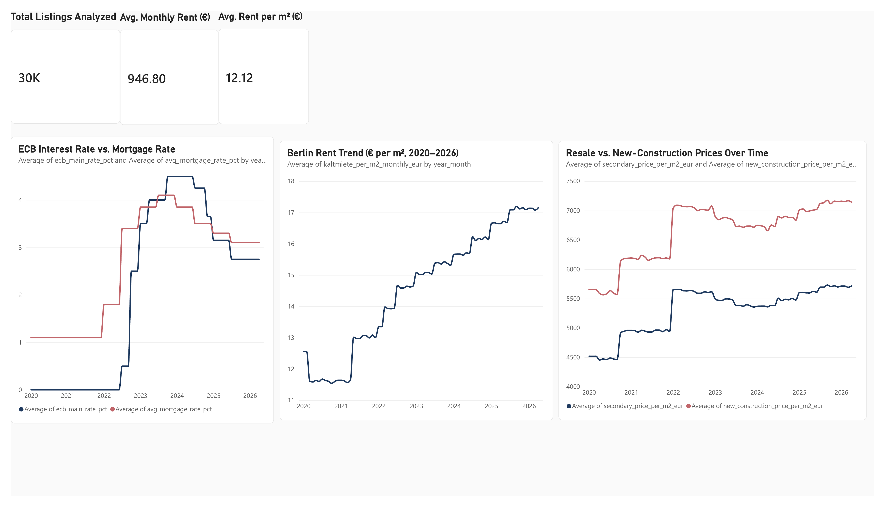
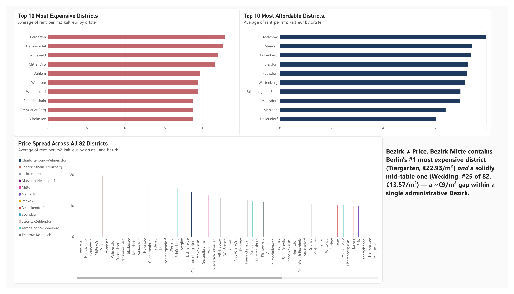
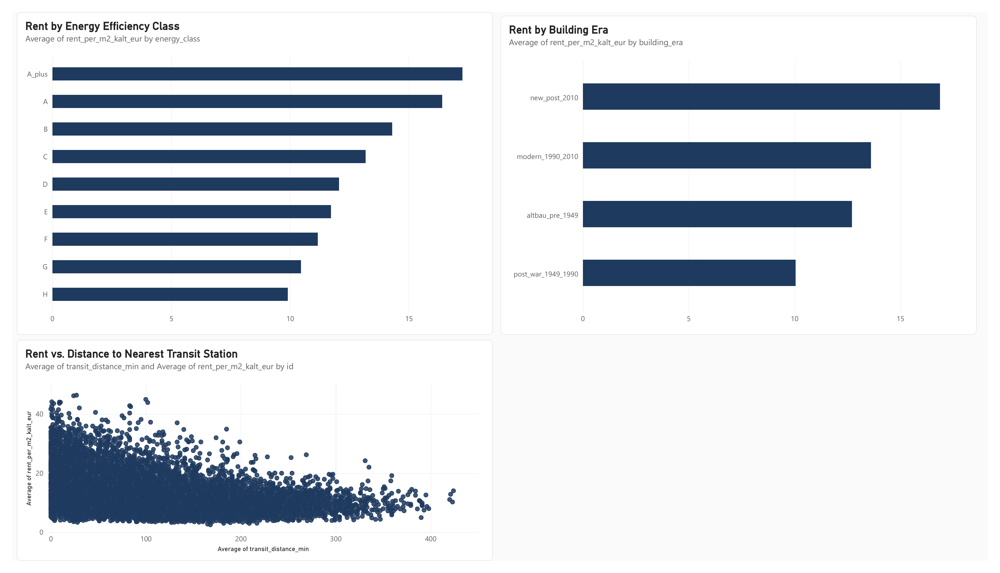

# Berlin Rent Market Analysis (Power BI Project)

## Introduction
This project analyzes Berlin's rental market (2020–2026) using a synthetic, multi-table dataset covering rental listings, resale prices, new-construction prices, and macroeconomic context (ECB and mortgage rates). Built in Power BI, it explores how rent has changed over time, how price varies by neighborhood, and what property characteristics actually drive price.

#### Note on the data

This dataset is synthetic. It was generated to resemble the Berlin market (realistic price levels, districts and trends), not collected from real listings. Source: [Berlin Real Estate: Sales & Rentals 2020–2026 (Kaggle)](https://www.kaggle.com/datasets/sergionefedov/berlin-real-estate-sales-and-rentals-2020-2026). The findings below describe patterns in this dataset, not verified facts about the actual Berlin market. The project's value is in the data modelling, preparation and analysis process.

## Background
Living in Berlin myself, I wanted a project that was personally relevant and technically demanding: multiple related tables, encoding problems and modelling challenges, rather than a single pre-cleaned file. This dataset covers 30,000 individual rental listings across 82 Berlin Ortsteile (districts), alongside monthly aggregated price data and macroeconomic indicators from 2020 through 2026.

The analysis was guided by three questions:
1. Is the Berlin housing market rising, falling, or stable — and how do rentals compare to sales?
2. Where in Berlin is affordable, and where isn't?
3. Besides location, what actually makes a property more expensive?

**Dataset scale:** The project combines 30,000 rental listings, 50,000 secondary-sale listings, 10,000 new-construction listings, 6,232 monthly neighbourhood-level observations across 82 Berlin Ortsteile, and 135 transit-station records. Rental and secondary-sale listings cover January 2020–April 2026; new-construction listings cover January 2021–April 2026.

## Tools Used
- **Power BI Desktop** — for data modeling, transformation, and all visuals.
- **Power Query** — for cleaning, type conversion, and building the data model's relationships.

## Data Model & Preparation
The dataset arrived structurally clean (no missing values, no duplicate rows), but still needed real preparation work:

- **Encoding fix:** German special characters (ö, ü, ß) were corrupted on initial load (e.g. "Neukölln" instead of "Neukölln"). Fixed by reloading the source CSVs with UTF-8 encoding explicitly set.
- **Currency standardization:** every price field existed in both EUR and USD; dropped the USD columns since this is a German-market analysis.
- **Date typing:** converted date fields from text to proper date types for accurate time-based charts.
- **Relationship modeling:** `rentals` and `kiez_prices_monthly` both repeat Ortsteil values many times, which caused Power BI to flag a many-to-many relationship. Fixed by building a dedicated `Ortsteil` dimension table (82 unique districts) and connecting both fact tables to it — a proper star schema instead of a direct, ambiguous link.

## Analysis

### Page 1: Market Overview
*Is the Berlin housing market rising, falling, or stable, and how do rentals compare to sales?*

- Average rent fell from €12.56/m² in January 2020 to €11.64/m² in January 2021, then rose steadily to €17.15/m² by April 2026 — approximately 36.6% above the January 2020 level.
- Between December 2021 and January 2022, average secondary-market prices rose from ~€4,941/m² to ~€5,654/m² (+14.4%), while new-construction prices rose from ~€6,177/m² to ~€7,043/m² (+14.0%) — both jumping in the same month.
- In January 2022, the average mortgage rate rose from 1.1% to 1.8% while the ECB's main rate remained at 0% — the ECB didn't raise rates until mid-2022. The timing shows mortgage pricing moved ahead of the ECB's policy change, though the dataset shows the timing, not the underlying cause.

### Page 2: Neighbourhood Comparison
*Where in Berlin is affordable, and where isn't?*

- The 10 most expensive districts: Tiergarten (€22.93/m²), Hansaviertel (€22.68), Grunewald (€22.02), Mitte/Ort (€21.61), Dahlem (€19.75), Wannsee (€19.45), Wilmersdorf (€19.42), Friedrichshain (€18.80), Prenzlauer Berg (€18.75), and Nikolassee (€18.75) — clustered in Berlin's center and southwest.
- The 10 most affordable: Hellersdorf (€6.06/m²), Marzahn (€6.42), Mahlsdorf (€6.97), Falkenhagener Feld (€7.00), Wartenberg (€7.16), Kaulsdorf (€7.24), Biesdorf (€7.29), Falkenberg (€7.41), Staaken (€7.44), and Malchow (€7.98) — all in the outer east, reflecting Berlin's historical east/west divide.
- Bezirk (borough) doesn't reliably predict price: Bezirk Mitte alone contains Berlin's single most expensive district (Tiergarten, €22.93/m²) *and* a solidly mid-table one (Wedding, ranked #25 of 82, €13.57/m²) — a ~€9/m² spread within one administrative area.

### Page 3: What Drives Price
*Besides location, what actually makes a property more expensive?*

- **Energy efficiency class** shows a near-perfect staircase relationship with price: A+ (€17.25/m²) → A (€16.40) → B (€14.30) → C (€13.18) → D (€12.06) → E (€11.72) → F (€11.17) → G (€10.46) → H (€9.91). This is the cleanest, most consistent relationship found in the whole dataset.
- **Building era** doesn't follow a simple "newer = pricier" rule: post-2010 construction leads at €16.87/m², followed by 1990–2010 at €13.61, but pre-1949 Altbau (€12.71) outranks post-war 1949–1990 construction (€10.05) despite being older. Building age alone doesn't explain rent — older architectural stock can retain a rental premium over newer, utilitarian post-war stock.
- **Transit proximity** is moderately associated with higher rents (Pearson r ≈ −0.37). The effect is clearest at the premium end: listings within 50 minutes of transit have a 95th-percentile rent of ~€25.79/m², compared to ~€14.90/m² beyond 200 minutes. Affordable listings remain available across nearly the full distance range, while the highest-priced listings become increasingly rare farther from transit. *Caveat:* the transit fields are not realistic in this synthetic dataset. Some listings are assigned stations over 30 km away, with travel times of up to 400+ minutes, so this relationship should be treated with caution.

## Insights
- **Location sets the ceiling, but doesn't tell the whole story** — Bezirk Mitte spans from Berlin's #1 most expensive district (Tiergarten) to a mid-table one (Wedding, #25 of 82), a ~€9/m² internal spread.
- **Energy efficiency is the single most consistent price driver found** — a clean, monotonic staircase from €17.25/m² (A+) down to €9.91/m² (H), more linear than location itself.
- **Building age alone doesn't explain rent** — pre-1949 Altbau properties (€12.71/m²) outrank 1949–1990 post-war stock (€10.05/m²) despite being older, suggesting older architectural stock can retain a rental premium the dataset doesn't fully explain on its own.
- **Transit access matters most at the premium end of the market** (r ≈ −0.37) — the priciest listings cluster near stations, while affordable listings remain available across most of the distance range (see the caveat on transit data above).
- **The January 2022 price jump preceded the ECB's rate hikes** — mortgage rates rose from 1.1% to 1.8% while the ECB rate was still 0%, showing the timing of the move, even if the dataset doesn't confirm the underlying cause.

## What I Learned
- **Data modeling** — building a proper star schema (a shared `Ortsteil` dimension table connecting two fact tables) instead of a risky many-to-many relationship.
- **Power Query fundamentals** — fixing character encoding issues, standardizing currency, and converting data types before analysis.
- **Choosing the right chart for the question** — using scatter plots for two continuous variables (transit distance vs. price) instead of misleading line charts, and understanding why aggregation type (Sum vs. Average) can completely change a chart's story.
- **Testing assumptions against actual numbers** — catching that a visual "same jump" pattern in 2020 and 2022 wasn't actually the same when checked (only one was a genuine jump), and confirming the mortgage/ECB timing gap with exact monthly figures rather than eyeballing a chart.
- **Design consistency** — applying a custom color theme and consistent titling across all three pages to make the dashboard genuinely readable, not just functional.
- **Checking data provenance** — investigating the dataset's source after noticing implausible values (e.g. transit times over 400 minutes), confirming it was synthetic, and reframing the findings accordingly.

## Conclusion
This project turned a synthetic, multi-table dataset about my own city into a structured Power BI dashboard, with each finding checked against the underlying numbers rather than read off a chart. Beyond the specific patterns in this dataset, the project demonstrates practical BI skills: data modeling, Power Query data preparation, thoughtful chart selection, and the discipline to verify a pattern against real numbers before treating it as a finding.
